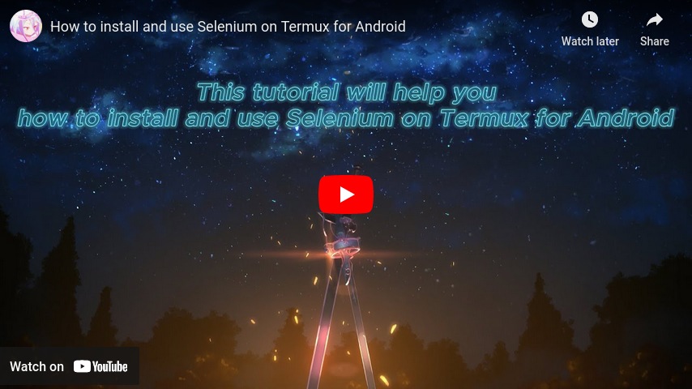
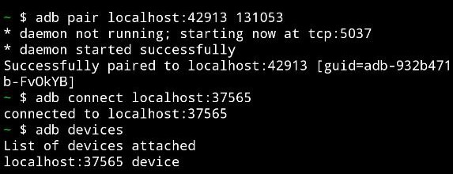
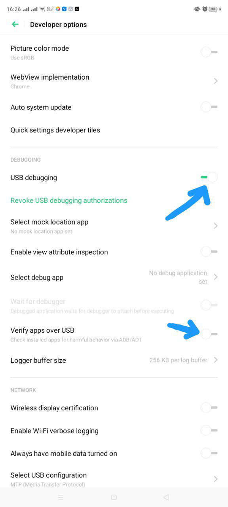
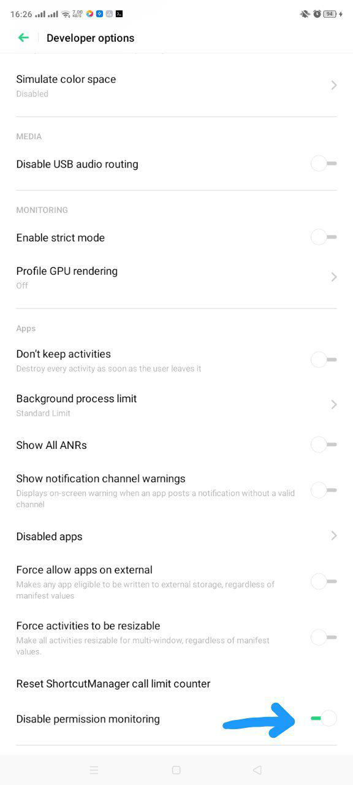
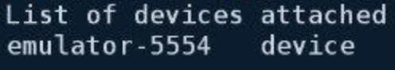

## Selenium-On-Termux-Android

- This tutorial will help you how to install and use Selenium on Termux for Android.

## Video

[](https://youtu.be/Y-PnMbHLHOI)

## Note

- PLease give me star if you like this tutorial <3.
- If you receive this error `OSError: [Errno 8] Exec format error: '/data/data/com.termux/files/usr/lib/python`**_X.YY_**`/site-packages/selenium/webdriver/common/linux/selenium-manager'`.
- Where **_X.YY_** is your Python version, example 3.8, 3.9, 3.10, 3.11, 3.12, ...
- That means you haven't installed the required package.

## Download

- Termux -> [F-Droid](https://f-droid.org/packages/com.termux/).

## Requirements

| Step | Command                                                               |
| ---- | --------------------------------------------------------------------- |
| 1    | Open Termux                                                           |
| 2    | Allow access to storage memory                                        |
| 3    | <pre><code>termux-setup-storage</code></pre>                          |
| 4    | Force exit Termux                                                     |
| 5    | Reopen Termux                                                         |
| 6    | Update & Upgrade package                                              |
| 7    | <pre><code>yes \| pkg update -y && yes \| pkg upgrade -y</code></pre> |
| 8    | Install pip (they seperated it from python)                           |
| 9    | <pre><code>yes \| pkg install python-pip -y</code></pre>              |
| 10   | Install selenium                                                      |
| 11   | <pre><code>pip install selenium==4.9.1</code></pre>                   |
| 12   | **_PLEASE MAKE SURE YOUR SELENIUM VERSION <= 4.9.1_**                 |

## Choose WebDriver you want install

<table>
  <tr>
    <th>Chromium</th>
    <th>Firefox</th>
  </tr>
  <tr>
    <td><pre><code>yes | pkg install x11-repo -y
yes | pkg install tur-repo -y
yes | pkg install chromium -y</code></pre></td>
    <td><pre><code>yes | pkg install x11-repo -y
yes | pkg install firefox -y
yes | pkg install geckodriver -y</code></pre></td>
  </tr>
</table>

## VNCServer

| Step | Command                                                                                                                                         |
| ---- | ----------------------------------------------------------------------------------------------------------------------------------------------- |
| 1    | <pre><code>curl -sLf https://raw.githubusercontent.com/Yisus7u7/termux-desktop-xfce/main/boostrap.sh \| bash</code></pre>                       |
| 2    | <pre><code>vncserver -listen tcp</code></pre>                                                                                                   |
| 3    | For first time you will see it show something like `New 'localhost:1 ()' desktop is localhost:1`, then `localhost:1` is your display ip address |
| 4    | You can download VNC Viewer from CH Play to view your webdriver, use `localhost:1` as the ip address                                            |

## Example

<table>
  <tr>
    <th>Type</th>
    <th>Video</th>
    <th>Chromium</th>
    <th>Firefox</th>
  </tr>
  <tr>
    <td>Headless</td>
    <td>Unknown</td>
    <td><pre><code>from selenium import webdriver
options = webdriver.ChromeOptions()
options.add_argument("--no-sandbox")
options.add_argument("--disable-dev-shm-usage")
options.add_argument("--headless=new")
driver = webdriver.Chrome(options=options)
driver.get("https://www.google.com")
driver.save_screenshot("/sdcard/download/screenshot.png")
print("Please check screenshot image")
driver.quit()</code></pre></td>
    <td><pre><code>from selenium import webdriver
options = webdriver.FirefoxOptions()
options.add_argument("--headless")
driver = webdriver.Firefox(options=options)
driver.get("https://www.google.com")
driver.save_screenshot("/sdcard/download/screenshot.png")
driver.quit()</code></pre></td>
  </tr>
  <tr>
    <td>Non-Headless</td>
    <td><video src="./assets/example_non_headless.mp4"></td>
    <td><pre><code>from selenium import webdriver
options = webdriver.ChromeOptions()
options.add_argument("--no-sandbox")
options.add_argument("--disable-dev-shm-usage")
options.add_argument("--display=:1") # localhost:1 -> display ID = 1
driver = webdriver.Chrome(options=options)
driver.get("https://www.google.com")
driver.save_screenshot("/sdcard/download/screenshot.png")
driver.quit()</code></pre></td>
    <td><pre><code>from selenium import webdriver
options = webdriver.FirefoxOptions()
options.add_argument("--display=:1") # localhost:1 -> display ID = 1
driver = webdriver.Firefox(options=options)
driver.get("https://www.google.com")
driver.save_screenshot("/sdcard/download/screenshot.png")
driver.quit()</code></pre></td>
  </tr>
</table>

## Chromium on Android (adb required)

| Chrome                                                                                                                      | Firefox                                                                                                                     |
| --------------------------------------------------------------------------------------------------------------------------- | --------------------------------------------------------------------------------------------------------------------------- |
| <video src="./assets/example_chrome.mp4"/> | <video src="./assets/example_firefox.mp4"/> |

- **_This is why you should use chromium instead of chrome and firefox_**
  - All data will be erased.
  - Bug/crash/error....

### Install Android SDK

- You need Android SDK to use adb control.

  ```
  yes | pkg install wget -y
  cd $HOME
  wget https://github.com/Lzhiyong/termux-ndk/releases/download/android-sdk/android-sdk-aarch64.zip
  unzip android-sdk-aarch64.zip -d android-sdk
  rm -r android-sdk-aarch64.zip
  echo "export ANDROID_HOME=$HOME/android-sdk" >> $HOME/.bashrc
  echo "export PATH=$PATH:$ANDROID_HOME/tools:$ANDROID_HOME/tools/bin:$ANDROID_HOME/platform-tools" >> $HOME/.bashrc
  ```

### Requirements

- You **_MUST_** install this to make it work.

  ```
  yes | pkg install android-tools -y
  yes | pkg install x11-repo -y
  yes | pkg install tur-repo -y
  yes | pkg install chromium -y
  ```

### Enable ADB Server

- You need ADB Server for selenium.
  <details>
  <summary>For rooted device</summary>

  - This is the easiest option.

    ```
    su -c stop adbd && su -c start adbd
    su -c setprop service.adb.tcp.port 5555
    ```

  </details>

  <details>
  <summary>For Android >= 11 and above</summary>

  - you can watch [Video tutorial](https://youtu.be/KCODAyc_6rU) for how to do that.
  - Run `adb pair localhost:<port_1> <security_code>`.
  - `<port_1>` != `<port_2>`, same port but it changes when pairing.
  - Run `adb connect localhost:<port_2>`.
  - 
  - Run `adb devices`.
  - Run `adb tcpip 5555`.

  </details>

  <details>
  <summary>For Android < 11, you *MUST have PC/Laptop</summary>

  - Go to your phone Settings.
  - Find Developer Mode.
  - Enable Developer Mode.
  - Follow me this step.

    | Settings 1                                                                                                                | Settings 2                                                                                                                |
    | --------------------------------------------------------------------------------------------------------------------------- | --------------------------------------------------------------------------------------------------------------------------- |
    |  |  |

  - If your device doesn't match or is not similar to my phone, then try [this solution](https://stackoverflow.com/questions/52079343/how-can-i-use-adb-to-grant-permission-without-root).
  - Connect your phone to PC/Laptop using a USB cable.
  - On PC/Laptop, open the shell with administrator.
  - Next, you need to install Choco (This is a very easy way to install adb).
  - Run `Get-ExecutionPolicy`.
  - Run `Set-ExecutionPolicy AllSigned`.
  - Run `Set-ExecutionPolicy Bypass -Scope Process`.
  - Run `Set-ExecutionPolicy Bypass -Scope Process -Force; [System.Net.ServicePointManager]::SecurityProtocol = [System.Net.ServicePointManager]::SecurityProtocol -bor 3072; iex ((New-Object System.Net.WebClient).DownloadString('https://community.chocolatey.org/install.ps1'))`.
  - After installing Choco, run `choco install adb`.
  - Open the command prompt on PC/Laptop, run `adb devices`.
  - Then continue run `adb tcpip 5555`.
  - \*And run this (I don't know if it's very important or not, but my Oppo phone needs this to run successfully) to allow termux write secure settings `adb shell pm grant com.termux android.permission.WRITE_SECURE_SETTINGS`.
  - Now you can unplug the USB cable.

  </details>

### Recheck Step

- Make sure you have enabled the ADB Server.
- Open Termux.
- Run `adb kill-server`.
- Then run `adb devices`.
- 
- Make sure you only see `emulator-5554` in the list.

### Important

- **_If you turn off or restart your device, you must enable ADB Server AGAIN_**.
- **_If you close termux app and open again, you need to active adb server by run `adb devices`_**.

### Example Code For Chromium

- [Download link](https://github.com/macchrome/droidchrome/tags) (current selenium only support chromium <= 110).
- Or use this [link](https://github.com/macchrome/droidchrome/releases/download/v110.5481.153-M110.0.5481.153-r1191-Ungoogled-And64/arm64_ChromePublic_HEVC-110.0.5481.153.apk) for fast download.
- Make sure you **_CLOSED_** all chromium instances before run this code (Chrome, Chrome Dev, Chrome Canary, Kiwi Browser, Brave, ....).

  ```
  import os
  os.system("adb devices")
  from selenium import webdriver
  options = webdriver.ChromeOptions()
  options.add_argument("--no-sandbox")
  options.add_argument("--disable-dev-shm-usage")
  options.add_experimental_option("androidPackage", "org.chromium.chrome.stable")
  driver = webdriver.Chrome(options=options)
  driver.get("https://www.google.com")
  print("Page title:", driver.title)
  driver.quit()
  ```

### Missing JAVA

- This means you must install JAVA.
  ```
  cd $HOME
  wget https://github.com/lzhiyong/termux-ndk/releases/download/openjdk/openjdk-11.0.12-aarch64.zip
  unzip openjdk-11.0.12-aarch64.zip -d openjdk-11.0.12
  rm -r openjdk-11.0.12-aarch64.zip
  echo "export PATH=$PATH:$HOME/openjdk-11.0.12/bin" >> $HOME/.bashrc
  echo "export JAVA_HOME=$HOME/openjdk-11.0.12" >> $HOME/.bashrc
  ```

## References

- Special thanks to [@mauro199304](https://github.com/mauro199304), [@remo7777](https://github.com/remo7777/), [@lzhiyong](https://github.com/lzhiyong) for this tutorial.
- [Termux Desktop Xfce](https://github.com/Yisus7u7/termux-desktop-xfce)
- [Termux Issues](https://github.com/termux/termux-packages/issues/2149)
